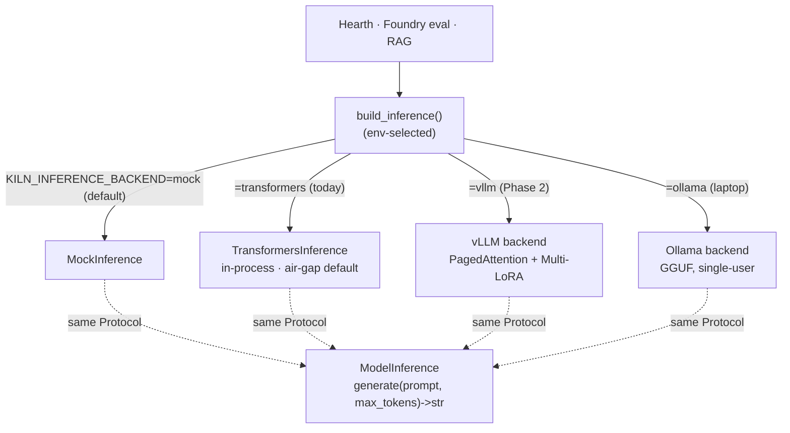
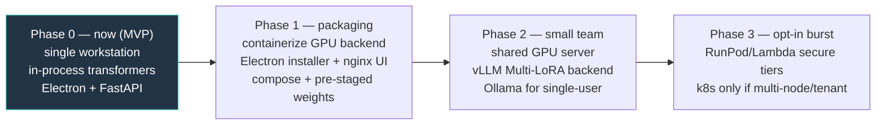

# Kiln — Deployment & Resource Options

> Research-backed options for running Kiln beyond the single validated
> workstation. Companion to [STATUS_AND_ROADMAP.md](STATUS_AND_ROADMAP.md).
> **Guiding principle:** Kiln is local-first and air-gappable by design — every
> cloud capability here is **opt-in, layered on top of a local core, never a
> requirement.** Validated baseline: one RTX 5080 (16 GB, Blackwell sm_120),
> torch 2.7.0+cu128.

---

## 1. Options at a glance

| Option | When to use | Rough 2026 cost | Air-gap? |
|--------|-------------|-----------------|----------|
| **Local workstation** (1 consumer GPU) | MVP, classified/air-gapped, single-SME-per-box | One-time ~$2k–4k (16–24 GB) / ~$6k–10k (48 GB pro) | ✅ Yes |
| **Self-hosted shared GPU server** (1× 48 GB, multi-user) | Small team, on-prem, shared base + many adapters | One-time ~$8k–20k | ✅ Yes |
| **On-demand cloud rental** (RunPod/Lambda) | Burst training / big eval sweeps | 4090 ~$0.31–0.34/hr; A100-80 ~$1.19–1.99/hr; H100 ~$2–4.29/hr; a <2 h 7–8B LoRA ≈ $1–5 | ❌ No |
| **Hyperscaler GPU** (AWS/GCP/Azure) | Only when a compliance regime mandates it | 2–4× the neo-cloud rate | ⚠️ Gov regions only |
| **Kubernetes + GPU Operator** | Multi-node / multi-tenant / managed hosting | infra-dependent | ⚠️ Hard |

**Local workstation is and should remain Kiln's primary supported target.** The
self-hosted shared server is the natural "team" step. Cloud rental is a burst
tier for teams that can tolerate data leaving the box (never for air-gapped
corpora; avoid untrusted marketplace hosts like Vast.ai community for sensitive
data). Hyperscalers and Kubernetes are for specific compliance/scale mandates
only.

---

## 2. Model serving

**Today:** `TransformersInference` (`foundry/src/inference_backends.py`) loads the
base model + optional PEFT adapter in-process and runs a blocking, greedy
`generate`. Correct, simple, dependency-light, and reused everywhere behind the
`ModelInference` Protocol — but no batching/paging, and it blocks the async loop
under load. **Fine for single-user local use; does not scale to concurrent chat.**

Because everything goes through the `ModelInference` Protocol + `build_inference()`
factory, additional backends are **drop-in via an env flag, no caller changes:**

- **vLLM** — the 2026 production default. PagedAttention throughput plus
  **first-class Multi-LoRA**: one resident base + many LoRA adapters selected per
  request, no reload. This maps perfectly onto Kiln's discipline-per-adapter /
  Hearth model-switching design. Add it behind the same Protocol
  (`KILN_INFERENCE_BACKEND=vllm`) for the team/concurrent tier.
- **Ollama** — easiest single-box/laptop option (GGUF, manages VRAM). Weaker
  multi-adapter story (expects adapters merged into GGUF). Good "one model, one
  user."
- **TGI** — now maintenance-mode; HF recommends vLLM. Don't adopt.

**LoRA serving patterns:** (1) keep adapters separate, serve via vLLM Multi-LoRA
(best for multi-discipline; add/swap disciplines with no base reload); or
(2) merge an adapter into base weights (note: Foundry `merging.py` is a no-op
placeholder today) and serve the merged GGUF via Ollama (simplest single
discipline on a laptop).

---

## 3. Containerization

Containerize the two halves separately — they have different lifecycles.

**Python + GPU backend** (`kiln_server.py` + all four tools):
- Base image FROM an NVIDIA CUDA runtime (or official PyTorch) **matching the
  validated Blackwell/sm_120 toolchain**.
- Keep the lazy-import design: a **multi-stage build** with a slim CPU stage
  (mock/dry-run, for CI) and a full CUDA stage (real backends).
- Run with `--gpus all` (NVIDIA Container Toolkit) / `runtime: nvidia`.
- Mount three volumes: **HF model cache** (bind-mount so weights aren't
  re-downloaded — critical for air-gap pre-staging), **adapters**, and
  **curriculum/SQLite data**.
- Flip mock→real purely via the env vars `backend_config.py` already reads — a
  clean 12-factor seam, no code changes.

**Electron / React UI** — two modes:
1. **Desktop app** (air-gap default): Electron is *not* containerized; ship a
   packaged installer (electron-builder) that talks to the backend over
   localhost/configured URL.
2. **Hosted/web**: build the Vite bundle, serve from a small nginx container
   (multi-stage node-build → nginx-serve). Requires making `backendUrl` real
   (it's currently hardcoded to `127.0.0.1:8420`).

**docker-compose** for single-box: a GPU `kiln-api` service, optional `kiln-ui`
nginx service, named volumes, a FastAPI healthcheck. Air-gap path: pre-pull
images, pre-stage HF weights into the cache volume, pin versions, vendor a
wheelhouse for offline installs.

---

## 4. Kubernetes (future scaling path only)

**Do not introduce k8s until there is a concrete multi-node, multi-tenant, or
managed-hosting requirement.** For the single-GPU MVP and air-gapped single-box
deployments it is clear overkill — it adds a control plane and storage complexity
that buys nothing for one GPU and works against the simple, ownable design. Use
docker-compose or the packaged Electron app there.

When warranted, the standard GPU pattern:
- **NVIDIA GPU Operator** manages driver, Container Toolkit, device plugin, DCGM
  metrics as DaemonSets (the de-facto way to expose GPUs to k8s).
- **GPU node pools** with taints/tolerations so only GPU workloads land on
  expensive nodes; CPU work (Quarry, FastAPI, UI) stays on cheap nodes. Pods
  request `nvidia.com/gpu: 1`.
- **Scaling:** GPUs aren't fractionally schedulable by default (one pod per GPU
  unless MIG or time-slicing). Use Cluster Autoscaler/Karpenter to scale GPU pools
  **to zero when idle**; HPA on the stateless FastAPI/UI tier. Run vLLM as the
  GPU Deployment (one base + Multi-LoRA, adapters on a RWX volume); keep training
  as finite Kubernetes **Jobs** on the GPU pool, separate from serving.
- Air-gapped k8s is possible (private registry, offline operator bundle) but
  materially harder — only for a customer that specifically needs an on-prem
  cluster.

---

## 5. Resource sizing

Rule of thumb: bf16 ≈ 2 bytes/param; 4-bit ≈ ~0.5–0.6 bytes/param; **plus** KV
cache (grows with context × batch) and activations.

**Inference (bf16 default):**

| Model | Weights | With KV/activations | Fits |
|-------|---------|----------------------|------|
| 3B bf16 | ~6 GB | ~8–10 GB | 8–12 GB GPU |
| 7–8B bf16 | ~14–16 GB | ~18–22 GB | 24 GB comfortably; **tight on the 16 GB 5080** |
| 7–8B 4-bit | ~5–6 GB | ~8–10 GB | 8–12 GB (4-bit unverified on Blackwell — bf16 preferred) |

LoRA adapters are tiny (tens of MB), so Multi-LoRA adds little VRAM beyond the
single resident base — the argument for vLLM Multi-LoRA on a 24–48 GB card.

**Training (LoRA/QLoRA, 300–500 examples):**

| Path | 7–8B | Notes |
|------|------|-------|
| QLoRA (4-bit base) | ~10–16 GB | feasible on 16 GB, comfy on 24 GB (where bnb available) |
| LoRA on bf16 base | ~24 GB | the Blackwell path (no bnb); small batch/seq, or step to 48 GB |
| 3B bf16 | ~12–16 GB | fits the validated tier |

Training time: <2 h for 300–500 examples on a modest GPU (per CLAUDE.md).

**Host:** ~32 GB system RAM recommended (16 GB workable inference-only); ~50–100 GB
disk for a couple of base models + HF cache + adapters + processed corpora
(each 7–8B bf16 base ≈ 15–16 GB on disk).

**Summary:** 8–12 GB GPU = 3B bf16 / 7–8B 4-bit inference + light QLoRA. **16–24 GB
(the validated 5080 tier) = 7–8B bf16 inference + 7–8B QLoRA training — the MVP
sweet spot.** 48 GB = comfortable 7–8B train+serve and many-adapter Multi-LoRA
for a shared team box.

---

## 6. Phased recommendation

- **Phase 0 (now):** stay single-workstation; deployment is *not* the blocker for
  the first real test — the wiring gaps in the roadmap are. Document the validated
  config (CUDA/torch versions, Blackwell bitsandbytes caveat).
- **Phase 1:** containerize the env-driven GPU backend; ship Electron + optional
  nginx UI; docker-compose single-box with pre-staged weights for offline/air-gap.
- **Phase 2:** self-hosted shared GPU server running vLLM (Multi-LoRA) behind the
  existing seam; Ollama for single-user.
- **Phase 3:** opt-in cloud burst for heavy training/eval; Kubernetes only on a
  concrete multi-node/tenant/hosting requirement (document, don't build).

Keep every cloud capability strictly opt-in; the fully local, air-gapped path
stays first-class and tested.

---

## Sources

- RunPod pricing — https://www.runpod.io/pricing
- GPU cloud pricing comparison 2026 — https://www.spheron.network/blog/gpu-cloud-pricing-comparison-2026/
- Vast.ai pricing — https://vast.ai/pricing
- RunPod/Lambda/CoreWeave comparison 2026 — https://www.buildmvpfast.com/blog/gpu-cloud-cost-comparison-runpod-lambda-labs-coreweave-2026
- vLLM LoRA docs — https://docs.vllm.ai/en/latest/features/lora/
- Ollama vs vLLM vs TGI 2026 — https://medium.com/@anupkawarase.akz/ollama-vs-vllm-vs-tgi-local-llm-serving-benchmark-2026-ba7d8474fea7
- Multi-LoRA serving — https://www.inferless.com/learn/how-to-serve-multi-lora-adapters
