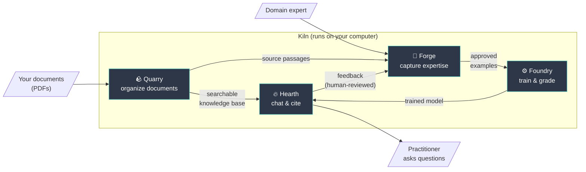
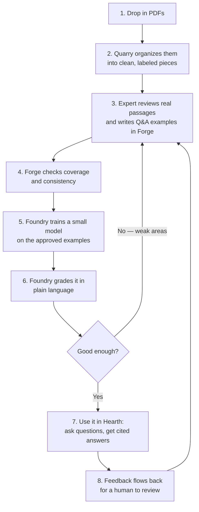

# Kiln — What It Does (Plain-Language Overview)

> A non-technical guide to what Kiln is, what each part does, and how they work
> together. For the engineering detail behind everything here, see
> [FUNCTIONALITY_TECHNICAL.md](FUNCTIONALITY_TECHNICAL.md).

---

## What is Kiln?

Kiln is a toolkit for building a **trustworthy AI assistant that is an expert in
one specific subject** — for example, the maintenance procedures in a fleet of
military vehicles — and that runs **entirely on your own computer**, with no
cloud service required.

The big idea: instead of trusting a general chatbot that might confidently make
things up, Kiln lets a real human expert shape the assistant, keeps a record of
*who* taught it *what*, and grounds its answers in your actual documents.

Two problems sink most "AI on our documents" projects, and Kiln is built around
fixing both:

1. **Bad source material.** Documents get chopped into pieces so clumsily that
   the AI can never find the right passage. Kiln cuts documents along their
   natural seams (sections, tables, procedures) so the right answer is
   retrievable.
2. **Made-up training data.** Many projects train models on text the AI wrote
   itself, which bakes in errors. Kiln **only ever trains on examples a named
   human expert wrote and approved.**

---

## The four tools

Kiln is one application made of four tools, each named after part of a kiln/forge
workshop. You move through them in order.

| Tool | Plain-language job | Think of it as… |
|------|--------------------|-----------------|
| 🪨 **Quarry** | Turns messy documents into clean, searchable pieces | The librarian who organizes the source material |
| 🔨 **Forge** | Helps a human expert write good training examples | The apprenticeship where the expert teaches |
| ⚙️ **Foundry** | Trains the model and grades how well it learned | The training gym and the exam room |
| 🔥 **Hearth** | The chat window where you actually use the assistant | The finished assistant you talk to |

### 🪨 Quarry — organize the documents
You give Quarry your PDFs. It figures out the document's structure (chapters,
sections, tables, lists), cleans out junk (page headers, boilerplate), and breaks
the content into well-formed, labeled pieces. It can even **diagnose why an
existing set of pieces is causing bad search results** and suggest fixes. The
output is a tidy, searchable knowledge base.

### 🔨 Forge — capture the expert's knowledge
Forge interviews a domain expert and walks them through writing **300–500 good
question-and-answer examples** that cover the full range of what the assistant
needs to know. It checks for gaps and inconsistencies, supports multiple
contributors, and tags every example with who wrote it. Nothing is invented by a
machine — it's all human-authored and human-approved.

### ⚙️ Foundry — train and grade
Foundry takes the expert's examples and **fine-tunes a small AI model** to think
like that discipline. Then it **grades the result in plain language** the expert
understands ("Procedural comprehension: 9/10") rather than cryptic math scores.
It tracks versions and warns you if a new version got worse at something it used
to handle.

### 🔥 Hearth — use the assistant
Hearth is the chat interface. You pick a trained model, ask questions, and get
answers **with citations back to the source documents** so you can verify them.
Your feedback ("this answer was wrong") is routed back to the experts as a
suggestion — but a human always decides whether to act on it. **Feedback never
silently becomes training data.**

---

## How the four tools work together

The tools form a loop: better documents make better training data, better
training data makes a better model, and feedback from real use improves both.

---

## The journey: from a stack of PDFs to a working assistant

---

## What's real today vs. still simulated

Kiln is honest about its current maturity. Here's the plain-language status.

| Capability | Status today |
|------------|--------------|
| Organizing documents (Quarry) | ✅ Real and working |
| Capturing expert examples (Forge) | ✅ Real and working |
| Training a real model (Foundry) | ✅ Real — verified on a real graphics card |
| Chatting with a real model (Hearth) | ✅ Real — verified on a real graphics card |
| Grading a model (Foundry) | ✅ Real |
| Using the tools via the app's **screens** | ✅ The Quarry screen is fully wired to its engine; ⚠️ the Forge, Foundry, and Hearth screens are visual mockups not yet connected to their (working) engines |
| **Chat answers grounded in your documents** | ⚠️ **Not yet connected** — the chat can run a real model, but it isn't yet pulling passages from your Quarry knowledge base (it uses a placeholder). This is the next major step. |
| A complete real expert curriculum | ⚠️ Needs a real domain expert to sit down and create one |
| A few internal quality scores | ⚠️ Placeholder values in spots |

> **In short:** every individual machine works for real, and the pieces have
> been proven end-to-end on real hardware. The main missing link before a
> first real-world test is **connecting the chat assistant to the document
> knowledge base** so its answers are grounded in your sources.

---

## Where Kiln runs

Kiln is **local-first**: it is designed to run completely on your own
hardware — a capable laptop or a workstation with a graphics card — with **no
internet connection required** after setup. That matters for sensitive material
(defense, legal, medical) where documents can't leave the building.

Running on a cloud graphics card or a larger shared deployment is **possible and
optional** — see [DEPLOYMENT_OPTIONS.md](DEPLOYMENT_OPTIONS.md) — but Kiln never
*requires* the cloud, and it never sends your documents anywhere you didn't
choose.

---

## A note on trust

Three design choices make Kiln suitable for regulated, high-stakes work:

- **Human-authored training data.** Every example is written and signed off by a
  named expert. You can audit exactly who taught the model what.
- **Cited answers.** The assistant points back to the source passage, so a human
  can verify rather than take its word.
- **Local ownership.** You own the model, the knowledge base, and the curriculum.
  There are no per-question fees and no external dependency.
