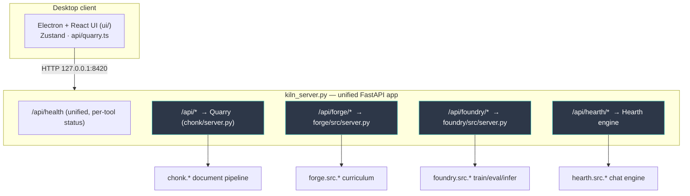
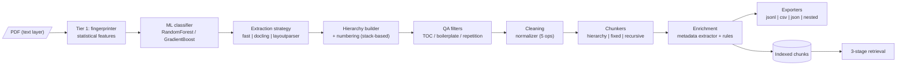
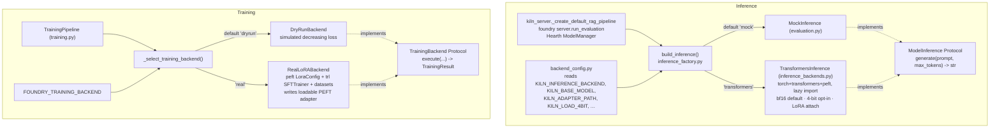
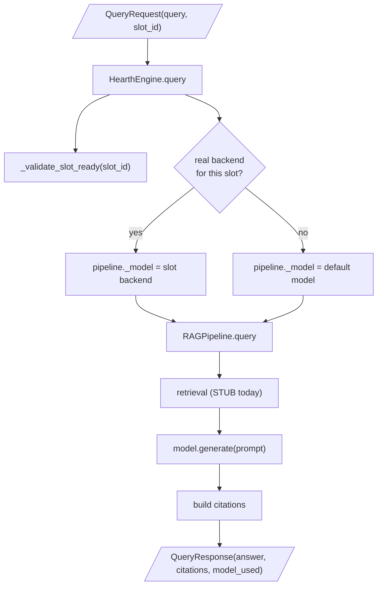
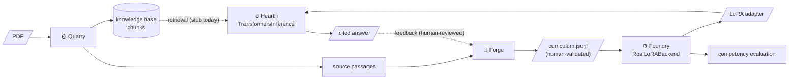

# Kiln — Technical Functionality Reference

> Engineering-level companion to [FUNCTIONALITY_OVERVIEW.md](FUNCTIONALITY_OVERVIEW.md).
> Describes the implemented system as it stands today, including the real
> model-execution layer and the known stubs. See also
> [ARCHITECTURE.md](ARCHITECTURE.md) and [DEPLOYMENT_OPTIONS.md](DEPLOYMENT_OPTIONS.md).

---

## 1. System overview

Kiln is a Python monorepo (FastAPI backends) with an Electron + React + TypeScript
desktop UI. A single FastAPI app, `kiln_server.py`, mounts all four tools' routers
behind one origin (`http://127.0.0.1:8420`) and exposes a unified `/api/health`.

- **Language/stack:** Python 3.10+ (runs on 3.13), FastAPI, Pydantic, scikit-learn,
  sentence-transformers, optional torch/transformers/peft/trl/datasets.
- **UI:** Electron shell (`ui/electron/main.js`) hosting a Vite/React app; Zustand
  state; one API client (`ui/src/api/quarry.ts`).
- **Design seam:** real model execution is opt-in behind Protocols; the default is
  mock/dry-run so the full suite runs with no GPU.



Each `_mount_*` in `kiln_server.py` wraps its import in `try/except` and records a
per-tool load status, so a missing optional dependency **degrades** one tool
rather than crashing startup.

---

## 2. Repository / module map

```
kiln/
├── quarry/chonk/         # Quarry (import as `chonk`)
│   ├── tier1/            # fingerprinter, classifier, taxonomy, fallback,
│   │                     #   manual_store, training_data, retraining, evaluation
│   ├── extraction/       # strategy + fast/docling/layoutparser extractors
│   ├── loaders/          # pdf, docx, markdown, text
│   ├── hierarchy/        # builder, numbering, tree, analyzer
│   ├── qa/               # filters, patterns, rules, filter_log
│   ├── cleaning/         # normalizer
│   ├── chunkers/         # base, hierarchy, fixed, recursive
│   ├── enrichment/       # extractor, profiles, rules, validators, result
│   ├── retrieval/        # pipeline, filters, search, validation (3-stage)
│   ├── exporters/        # base, jsonl, csv_export, json_export, schema
│   ├── diagnostics/      # analyzer, fix_orchestrator, fix_strategies,
│   │                     #   question_generator, test_runner
│   ├── comparison/       # comparer, metrics
│   ├── testing/          # embedder, searcher
│   ├── analysis/         # pdf_structure, structure
│   ├── core/document.py  # Block, BlockType, Chunk, QualityScore, ChonkDocument
│   ├── utils/            # tokens, quality
│   └── server.py         # Quarry FastAPI router
├── forge/src/            # models, storage, discovery, competency, coverage,
│   │                     #   examples, consistency, contributors, test_split,
│   │                     #   quarry_integration, server
├── foundry/src/          # training, training_backends, backend_config,
│   │                     #   inference_factory, inference_backends, evaluation,
│   │                     #   rag_integration, diagnostics, regression, merging, server
├── hearth/src/           # inference, feedback, server
├── shared/hardening.py   # retry, resource monitor, input validation, health
├── kiln_server.py        # unified mount
└── ui/                   # Electron + React + TS
```

---

## 3. Quarry — document processing

**Purpose:** transform PDFs into metadata-enriched, retrieval-ready chunks, and
diagnose why an existing chunk set retrieves poorly.

### Tiered pipeline



- **Tier 1 (`tier1/`):** `fingerprinter.py` extracts statistical features (byte,
  font, layout, character, repetition, structural-rhythm). `classifier.py` is a
  **traditional ML** model (RandomForest/GradientBoost via scikit-learn — *not* an
  LLM, by design), with `taxonomy.py` document-type profiles, `fallback.py` for
  low-confidence cases, `manual_store.py` for manual labels, and
  `training_data.py`/`retraining.py` for corpus generation and retraining.
- **Extraction (`extraction/`):** `strategy.py` selects a tier — `fast_extractor`
  (PyMuPDF/pdfplumber), `docling_extractor` (IBM Docling, best structure),
  `layoutparser_extractor` (deep layout). Optional deps probed via
  `importlib.util.find_spec`.
- **Tier 3 (`hierarchy/`, `qa/`, `cleaning/`, `enrichment/`):** builds a section
  tree (`builder.py`, `numbering.py`), filters zero-value content with an audit
  trail (`qa/filter_log.py`), normalizes text, and attaches metadata for filtered
  retrieval.
- **Chunkers (`chunkers/`):** merge blocks into chunks — hierarchical (recommended,
  one chunk per section with hierarchy path), fixed (token window, baseline),
  recursive.
- **Retrieval (`retrieval/`):** 3-stage — `filters.py` deterministic metadata
  pre-filter (80–90% search-space reduction) → `search.py` semantic search
  (sentence-transformers `all-MiniLM-L6-v2`) → `validation.py` pattern validation.
- **Diagnostics (`diagnostics/`):** detects four chunk-failure classes
  (semantic incompleteness/contamination, structural breakage, reference
  orphaning) and proposes fixes.

**Live server path vs library.** Important nuance: the *running* server
(`chonk/server.py`) wires a focused subset — upload → extraction
(PyMuPDF/pdfplumber, with heuristic heading detection in `loaders/pdf.py`) →
`HierarchyChunker` → real `QualityAnalyzer` → an in-memory embedding index
(`testing/searcher.py`, real `all-MiniLM` cosine search). The Tier-1 classifier,
`qa/filters`, `cleaning/normalizer`, `enrichment`, and the 3-stage
`retrieval/pipeline` are **fully implemented and unit-tested but not invoked by
the live upload/search flow** — they run from `scripts/demo_mvp.py`. There are
two retrieval implementations: `testing/searcher.py` (semantic, used by the
server) and `retrieval/pipeline.py` (the documented 3-stage metadata-filtered
design, which currently ships only a keyword `SearchProvider`).

**Status:** the live path processes real PDFs end to end with real semantic
search. Stubs/notes: `server.py:957` (hierarchy-stats) returns a placeholder
`quality_score = 1.0` (the main chunking path uses the real `QualityAnalyzer`);
the classifier is trained on synthetic profile data, not real documents;
`chonk/server.py` uses `allow_origins=["*"]` (vs pinned localhost in
`kiln_server.py`).

---

## 4. Forge — curriculum builder

**Purpose:** guide a domain expert to produce 300–500 human-validated,
discipline-level training examples.

- `models.py` — `Contributor`, `Discipline`, `Competency`, `Example`,
  `DiscoverySession`.
- `storage.py` — `ForgeStorage` (SQLite CRUD, coverage report, JSONL export).
- `discovery.py` — discipline discovery interview (`DiscoveryEngine`,
  `QuestionCatalog`).
- `competency.py` / `coverage.py` — competency mapping + coverage analysis.
- `examples.py` — `ExampleElicitor` (drafts, reasoning patterns).
- `consistency.py` — `ConsistencyChecker` (quality scaffolding).
- `contributors.py` — multi-contributor `ReviewQueue`/`ReviewDecision`.
- `test_split.py` — held-out test set reservation.
- `quarry_integration.py` — `QuarryBridge` pulls candidate passages from Quarry
  chunks so examples are grounded in real source text.

Output: an **Alpaca-format JSONL** curriculum (`instruction`/`input`/`output` +
provenance metadata: example_id, discipline_id, competency_id, contributor_id,
review_status), consumed by Foundry.

**Status:** functional. Producing a *real* curriculum requires a domain-expert
session (outstanding T-020). Gap: `storage.py` export filters by `is_test_set`
but **not** by `review_status`, so approval is recorded as metadata yet not
enforced as an export gate — fix before any real curriculum trains a model.

---

## 5. Foundry — training, evaluation, inference

This is where the real model-execution layer lives. The central design rule:
**mock/dry-run is the default; real execution is opt-in via environment variables,
behind Protocols, with heavy imports done lazily.**

### 5.1 Backend selection seam



### 5.2 Inference (`inference_backends.py`, `inference_factory.py`, `backend_config.py`)

- `TransformersInference` implements the `ModelInference` Protocol from
  `evaluation.py`. All of torch/transformers/peft/bitsandbytes are imported
  **inside** `__init__`/`generate`/`close` so importing the module is dependency-free.
  bf16 by default (`dtype` kwarg), 4-bit via `BitsAndBytesConfig` when
  `KILN_LOAD_4BIT=1`, optional `PeftModel.from_pretrained` adapter attach, chat
  prompt via `tokenizer.apply_chat_template`, prompt-token slicing on decode,
  `close()` with `gc.collect()` + `empty_cache()`.
- `build_inference()` is the single decision point; lazy-imports the real backend
  only when selected; raises `InferenceConfigError` if `transformers` is selected
  without a base model.
- `backend_config.py` is pure env-reading (no heavy imports) — safe to import in
  the degraded mount.

### 5.3 Training (`training.py`, `training_backends.py`)

- `TrainingPipeline` validates config, loads/splits the curriculum, then delegates
  execution to a `TrainingBackend` (resolved by env, default `DryRunBackend`).
- `DryRunBackend` reproduces the original simulator (decreasing loss, callback
  events) verbatim — keeps the suite green with no GPU.
- `RealLoRABackend` formats the Alpaca curriculum with the chat template into a
  `datasets.Dataset`, builds `LoraConfig` (per-family `resolve_target_modules`,
  e.g. Phi-3 → `qkv_proj`/`o_proj`), runs `trl.SFTTrainer`, and saves a real PEFT
  adapter (`adapter_config.json` + `adapter_model.safetensors`). An
  `_HFCallbackBridge` maps HF trainer events to the `TrainingProgressCallback`.

### 5.4 Evaluation (`evaluation.py`)

- `EvaluationRunner` scores model output against a held-out set and reports in
  **competency language** (SME-friendly), not ML metrics.
- Scorers behind a `SimilarityScorer` Protocol: `KeywordSimilarityScorer`
  (Jaccard, default) and `EmbeddingSimilarityScorer` (cosine over cached
  `all-MiniLM-L6-v2`, better for nondeterministic real output).

### 5.5 RAG, regression, merging, diagnostics

- `rag_integration.py` — `RAGPipeline` (retrieval + `ContextBuilder` + a
  `ModelInference` model), `RAGEvaluator`. This is the generation core Hearth wraps.
- `regression.py` — version management + regression detection between runs.
- `merging.py` — `LinearMerger`/`TIESMerger` (the density-threshold merge is a
  **no-op placeholder** for MVP).
- `diagnostics.py` — training trend/convergence/overfit analysis.

**Status:** inference and training are **real and GPU-validated** (RTX 5080: real
Qwen2.5-0.5B inference and a real LoRA fine-tune → reloadable adapter). Stubs:
merging no-op; `run_evaluation` builds the model per request (now memoized) and
runs synchronously inside the async loop; real `val_loss` not yet wired.

---

## 6. Hearth — interaction layer

**Purpose:** the chat engine — pick a model slot, query, return cited answers,
capture feedback.



- `inference.py` — `HearthEngine` wraps a `RAGPipeline` + `ModelManager`.
  `ModelManager` registers slots and (when the real backend is enabled) loads a
  real `TransformersInference` per slot with **single-resident eviction** (loading
  a new slot frees the previous; reload frees the prior backend). `query()` routes
  generation to the slot's backend and restores the default afterward (so a real
  model never bleeds into a later mock query).
- `feedback.py` — `FeedbackStore`, `SignalRouter`, `PatternAnalyzer`. Routes
  feedback to Quarry/Forge as **human-reviewed suggestions**; never auto-generates
  training data.

**Status:** real per-slot inference works; **retrieval is a stub**
(`kiln_server._create_default_rag_pipeline` injects a `_StubRetrieval` returning no
chunks), so chat answers are not yet grounded in a real Quarry index. This is the
top integration gap.

---

## 7. Configuration (environment flags)

| Variable | Effect | Default |
|---|---|---|
| `KILN_INFERENCE_BACKEND` | `mock` or `transformers` | `mock` |
| `KILN_BASE_MODEL` | base model id (required for real inference) | — |
| `KILN_ADAPTER_PATH` | LoRA adapter to attach at inference | — |
| `KILN_LOAD_4BIT` | 4-bit quant (needs `bitsandbytes`/`[quant]`) | `0` (bf16) |
| `KILN_INFERENCE_DTYPE` | torch dtype for bf16/fp16 path | `bfloat16` |
| `KILN_MAX_NEW_TOKENS` | generation length cap | `512` |
| `FOUNDRY_TRAINING_BACKEND` | `dryrun` or `real` | `dryrun` |
| `KILN_RUN_GPU_TESTS` | run `gpu`-marked tests | unset |

Install extras: `pip install -e ".[inference]"` (transformers+peft),
`".[training]"` (peft+trl+datasets), `".[quant]"` (bitsandbytes).

---

## 8. End-to-end data flow



---

## 9. Testing & quality gates

- ~1,960 tests across `quarry/tests`, `forge/tests`, `foundry/tests`,
  `tests/integration`, `shared/tests`, `hearth/tests`.
- `pytest-xdist` (`addopts = "-n auto"`) parallelizes the suite (~624 s → ~380 s).
- GPU tests carry the `gpu` marker and are skipped unless `KILN_RUN_GPU_TESTS=1`
  (root `conftest.py`).
- Stop-time quality gate (`.claude/hooks/quality-gate.js`) scopes tests to changed
  modules, runs ruff/secret/conflict checks; bandit if installed.

---

## 10. Security posture

- Unified server pins CORS to localhost; **Quarry's standalone router still uses
  `allow_origins=["*"]`** (tighten before any non-local deployment).
- PDF parsing should run with size/time limits (per CLAUDE.md security checklist);
  optional-dependency probes use `importlib.util.find_spec` (no eval/exec).
- No synthetic training data; human-validated provenance throughout.
- Secrets: `.env` is gitignored; **`.env.example` currently contains a real-looking
  key and must be replaced with a placeholder + rotated.**

---

## 11. Known gaps / tech debt (prioritized)

1. **Hearth retrieval is a stub** — wire real Quarry retrieval into the chat
   `RAGPipeline` (top blocker for a grounded real test).
2. `run_evaluation` loads the model synchronously inside the async event loop;
   per-slot `HearthEngine.query` has no concurrency lock.
3. Quarry `quality_score = 1.0` placeholder; Foundry `merging` no-op.
4. Real `val_loss` not computed in `RealLoRABackend`; eval report provenance uses
   the requested model name, not the env-derived model.
5. CORS wildcard in `chonk/server.py`; root `README.md` is stale.
6. 4-bit (bitsandbytes) on Blackwell/sm_120 unverified — bf16 is the default.
7. **UI is wired for Quarry only** — the Forge/Foundry/Hearth screens use local
   mock state; their API clients (`ui/src/api/forge.ts`, `foundry.ts`,
   `hearth.ts`) exist but are not imported by any component.
8. Forge export does not enforce `review_status` (human-validation gate).
