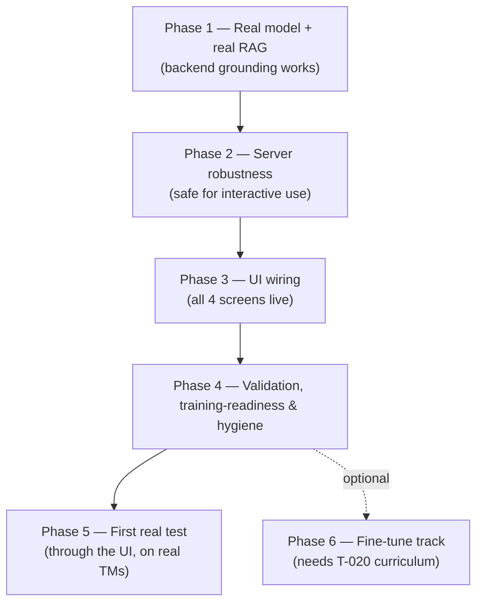

# Kiln — Readiness Plan (Get Everything Set → First Real Test)

> The plan to take Kiln from "all parts built, last-mile unwired" to a **complete,
> front-end-driven first real test** on real military technical manuals (TMs).
> Builds on [STATUS_AND_ROADMAP.md](STATUS_AND_ROADMAP.md). Decisions baked in:
> **American models only** (Llama-class; Qwen defaults removed), **the test must
> run through the UI**, TMs supplied by the user (MIL-STD PDF in-repo used until
> then).

---

## Guiding constraints

- **American models only.** Llama-3.2-3B-Instruct is the target base. All Qwen
  defaults (currently `Qwen2.5-0.5B-Instruct` in `backend_config.py` + GPU tests)
  are replaced. *Note:* Llama models are **gated** on Hugging Face (one-time
  license acceptance + access token). Ungated American fallback if we want to
  avoid gating: `microsoft/Phi-3.5-mini-instruct` (MIT) or `allenai/OLMo-2-*`
  (Apache). **Decision needed — see end.**
- **Front-end first.** Proof = upload a TM and get a grounded, cited answer
  **in the Hearth chat screen**. That requires wiring all four UI screens.
- **Local-first preserved.** No cloud dependency introduced; everything runs on
  the 5080.

---

## Phased plan

---

### Phase 1 — Real model + real RAG (the core grounding)

| # | Task | Effort | Acceptance |
|---|------|--------|------------|
| 1.1 | Swap **all Qwen defaults → American** (`backend_config.get_validation_model`, GPU tests, docs). Add HF-gating handling (token via env, clear error if missing). | M | No Qwen ids remain; tests use an American model id |
| 1.2 | Download + validate **Llama-3.2-3B-Instruct** real inference on the 5080 (bf16). | S | Coherent generation, VRAM within budget |
| 1.3 | **`RealQuarryRetrievalAdapter`** implementing Foundry's `RetrievalAdapter`, wrapping the live `RetrievalTester`; returns `text` + `chunk_id`/`page`/`document_title`/`section`. | M | Unit test: returns ranked chunks with citable metadata |
| 1.4 | **Shared chunk index** Quarry↔Hearth — persist the index to disk + reload (chosen over in-process singleton so it survives restarts and works in containers later). | M-L | Upload in Quarry → Hearth reads the same corpus across processes |
| 1.5 | Replace `_StubRetrieval` in `kiln_server._create_default_rag_pipeline` with the real adapter; verify citations propagate through `/api/hearth/query`. | M | Integration test: upload → query → answer + ≥1 resolving citation |

**Exit criteria:** a real, American-model, grounded+cited answer over the in-repo
MIL-STD PDF, verified at the API layer.

### Phase 2 — Server robustness (safe for interactive UI use)

| # | Task | Effort | Acceptance |
|---|------|--------|------------|
| 2.1 | Move blocking `model.generate` off the async loop (`run_in_threadpool`) in Hearth query handlers + Foundry `run_evaluation`. | M | Concurrent requests don't freeze the event loop (test) |
| 2.2 | Guard the per-slot `pipeline._model` mutation against concurrency (per-request pipeline or lock). | S-M | Concurrent multi-slot queries don't cross-contaminate |
| 2.3 | Upload-path hardening: enforce size limit at the HTTP boundary + guaranteed temp-file cleanup; consider sandboxed PDF parse. | M | Oversized/garbage uploads rejected cleanly; no temp leak |

### Phase 3 — UI wiring (front-end test requirement)

| # | Task | Effort | Acceptance |
|---|------|--------|------------|
| 3.1 | Make `backendUrl` real (env/config-driven) + persist settings; stop hardcoding `127.0.0.1:8420`. | S-M | Changing the URL routes API calls |
| 3.2 | **Hearth chat screen** → `/api/hearth/query` (replace the `setTimeout` placeholder); render answer + citations. | M | Real cited answer appears in the chat UI |
| 3.3 | **Forge screen** → forge API (discovery/competency/examples/consistency/coverage). | L | Create a discipline + example end-to-end in the UI |
| 3.4 | **Foundry screen** → foundry API (training start/status, evaluation, diagnostics). | L | Kick a (dry-run) training + see eval in the UI |
| 3.5 | UI tests (vitest) for the newly wired flows; typecheck + lint green. | M | `npm run typecheck/lint/test` green |

### Phase 4 — Validation, training-readiness & hygiene

| # | Task | Effort | Acceptance |
|---|------|--------|------------|
| 4.1 | Forge **`review_status` export gate** — only APPROVED examples export to training. | S | Unapproved examples excluded (test) |
| 4.2 | `RealLoRABackend` emits real `eval_loss` (set eval strategy). | S | Non-null val metrics in a real run |
| 4.3 | `merging.py` — implement linear/TIES or clearly gate as non-functional in UI/docs. | M | No silent no-op presented as working |
| 4.4 | Fix `quality_score=1.0` placeholder (`chonk/server.py:957`). | S | Real score returned |
| 4.5 | Tighten Quarry standalone CORS; add `--cov-fail-under=80`; **refresh stale `README.md`**. | S-M | Accurate README; CORS pinned; coverage gated |

### Phase 5 — First real test (through the UI)

1. Receive the user's real TM PDFs (text-layer).
2. Upload via the **Quarry screen** → confirm structure-aware chunks + quality.
3. In the **Hearth screen**, ask factual questions answerable from the TM.
4. Confirm: real Llama-3.2-3B answer, grounded in retrieved chunks, with citations
   resolving to the correct page/section — **all visible in the app**.
5. Capture screenshots; document the validated end-to-end run.

### Phase 6 — Fine-tune track (optional, parallel; needs a curriculum)

- T-020: a domain expert authors 30–50 approved examples in Forge (the long pole,
  human-gated). Then `FOUNDRY_TRAINING_BACKEND=real` LoRA on Llama-3.2-3B →
  register adapter in a Hearth slot → compare base vs adapter answers in the UI.
- The RAG test (Phases 1–5) does **not** depend on this.

---

## Sequencing & rough size

Phases 1→2→3→4 are largely sequential (UI wiring depends on robust backends);
4 can overlap 3. Ballpark: **Phase 1 ~3–4 days, Phase 2 ~2 days, Phase 3 ~4–6
days (UI is the largest), Phase 4 ~2–3 days**, then the test. Each task lands as
a small PR with tests; the suite stays green throughout (mock/dry-run defaults
preserved; real paths behind env flags + GPU-marked tests).

## Decisions needed before I start

1. **Llama gating:** OK to use **gated Llama-3.2-3B** (you/we accept the Meta
   license on HF + provide an access token), or prefer an **ungated American
   model** (`Phi-3.5-mini`, MIT) to avoid the token step? *(Recommendation:
   Llama-3.2-3B as requested, with Phi-3.5-mini as the no-token fallback.)*
2. **Scope confirmation:** proceed with **all of Phases 1–5** as one program
   (I'll execute phase by phase, PR per task), or trim/re-order anything?
