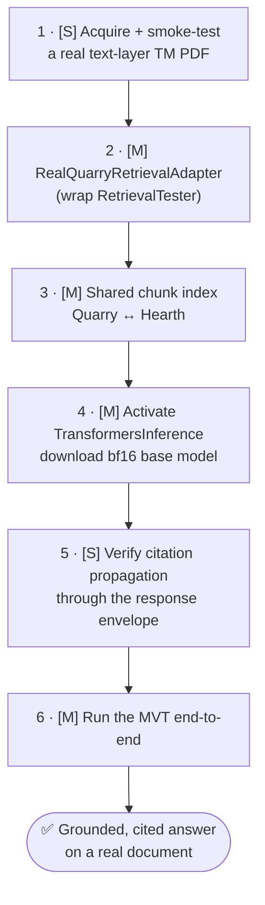

# Kiln — Status & Roadmap to First Real Test

> Planning brief produced from a full multi-agent review of the codebase
> (2026-06-27). Companion to [FUNCTIONALITY_TECHNICAL.md](FUNCTIONALITY_TECHNICAL.md)
> and [DEPLOYMENT_OPTIONS.md](DEPLOYMENT_OPTIONS.md).

---

## 1. Executive summary

Kiln is a four-tool pipeline (Quarry → Forge → Foundry → Hearth) unified behind
one FastAPI app (`kiln_server.py`) with an Electron/React UI. ~1,960 tests pass
and the real model stack is validated on an RTX 5080 (torch cu128). The
architecture is genuinely strong: heavy ML sits behind clean `Protocol` seams
with safe mock/dry-run defaults, then flips to real execution via env vars with
no code changes.

**The central gap is last-mile wiring, not missing capability.** Most
load-bearing modules are implemented and unit-tested but not connected into the
live request paths:

- **Quarry** processes documents for real on the server path (PyMuPDF/pdfplumber
  → `HierarchyChunker` → real `QualityAnalyzer` → real `all-MiniLM` embeddings in
  `RetrievalTester`). But the documented "tiered" pipeline (Tier-1 classifier, QA
  filter, normalizer, enrichment, 3-stage retrieval) runs **only in
  `scripts/demo_mvp.py`**, not in the live upload/search flow.
- **Hearth chat runs end-to-end but answers with zero document grounding** —
  `kiln_server.py:_create_default_rag_pipeline()` injects a `_StubRetrieval` that
  always returns `[]`. **This is the single biggest blocker.**
- **Foundry** has real LoRA training (`RealLoRABackend`, validated) and real
  inference (`TransformersInference`), both opt-in and never run end-to-end.
  Merging is a no-op placeholder.
- **The UI is real for Quarry only.** `api/forge.ts`/`foundry.ts`/`hearth.ts`
  exist but are imported by no component; those three screens mutate local Zustand
  state with fabricated objects.
- **The classifier has never seen a real document** (trained on synthetic feature
  vectors from `taxonomy.py`).
- **No human-authored curriculum exists** (T-020 outstanding).

**Bottom line:** the strongest leg (real PDF → structure-aware chunks → semantic
retrieval) already works in Quarry. The first real test is achievable in **days,
not weeks**, because it requires *connecting* existing real components.

---

## 2. Per-tool status

| Tool | Live/wired? | What's real | What's mock / unwired | Headline gap |
|------|-------------|-------------|------------------------|--------------|
| **Quarry** | ✅ | extraction, `HierarchyChunker`, real `QualityAnalyzer`, real `all-MiniLM` cosine search, JSONL/JSON/CSV export | Tier-1 classifier, `qa/filters`, `cleaning`, `enrichment`, 3-stage `retrieval/pipeline` — exist but unwired; `quality_score=1.0` at `server.py:957` | full tiered pipeline only in demo script; two parallel retrieval systems |
| **Forge** | ✅ | discovery→competency→examples→consistency→coverage→test-split→Alpaca JSONL, ~400 tests | no LLM (by design); `export_to_jsonl` filters by `is_test_set` but **not** `review_status` | no real curriculum (T-020); approval not an export gate |
| **Foundry** | ⚠️ partial | real `RealLoRABackend`, real `TransformersInference`, diagnostics/regression/eval, `EmbeddingSimilarityScorer` | `merging.py` no-op; dry-run default; `run_evaluation` blocks async loop; no real `val_loss` | real train→eval never run end-to-end |
| **Hearth** | ⚠️ HTTP only | full REST surface, conversation tracking, per-slot routing, human-gated feedback | **`_StubRetrieval` returns `[]`** → empty context, zero citations; in-memory; blocking generation | the stub retriever |
| **UI** | ⚠️ Quarry only | Quarry CRUD/upload/search/diagnostics/export vs real backend; nav, health, a11y | Forge/Foundry/Hearth screens mock-only; settings not persisted; `backendUrl` decorative | 3 of 4 screens never hit their (existing) routers |
| **Cross-cutting** | — | lazy mounting, `/api/health`, restricted CORS on unified app, `shared/hardening.py` | standalone Quarry CORS `*`; unbounded upload; in-process PDF parsing; coverage not enforced | upload-path hardening |

---

## 3. Critical path to the first real end-to-end test

**Minimum Viable Test (MVT):** RAG-grounded Q&A on one real text-layer military
TM PDF, **no fine-tuning**. Upload via Quarry → ask one factual question via
Hearth → get a real-model answer carrying ≥1 citation that resolves to the actual
chunk/page. This proves the whole value chain while sidestepping the two slow
dependencies (human curriculum + LoRA training).

1. **[S]** Acquire + smoke-test a real text-layer TM PDF (`POST /api/documents/upload`
   then `POST /api/test/search`). Confirm non-empty blocks, sensible chunks, real
   quality scores. (Must be text-layer — no OCR in MVP.)
2. **[M]** Write `RealQuarryRetrievalAdapter` implementing Foundry's
   `RetrievalAdapter` protocol, wrapping the live `RetrievalTester`
   (`quarry/chonk/testing/searcher.py`). Return dicts with `text` + metadata
   (`chunk_id`, `page`, `document_title`, `section`) so `ContextBuilder.extract_citations`
   can cite. Replace `_StubRetrieval` in `kiln_server.py` (~lines 204–242).
3. **[M]** Solve shared-index access — Quarry's index lives in `chonk.server`
   module-level `_state['tester']` (in-memory, per-process); expose it as a shared
   singleton (or persist/reload an index path) so Hearth reads the same corpus.
   Add an integration test: upload → Hearth retrieval returns >0 chunks.
4. **[M]** Activate a real backend: download a base model (3B fits 8–12 GB; 7–8B
   bf16 ~18–22 GB fits the 16 GB 5080 tightly — prefer a 3–7B for headroom), set
   `KILN_INFERENCE_BACKEND=transformers` + `KILN_BASE_MODEL`. Stay bf16
   (bitsandbytes 4-bit unverified on Blackwell).
5. **[S]** Verify citations survive the Hearth response envelope
   (`/api/hearth/query`).
6. **[M]** Run the MVT and confirm a grounded answer + ≥1 resolving citation.

**Estimated critical path: ~2–4 focused days**, dominated by the adapter, the
shared-index plumbing, and model download/verification.

**Second test (separate milestone — do NOT block the first):** T-020 human curriculum
(30–50 examples) in Forge → `FOUNDRY_TRAINING_BACKEND=real` LoRA → register the
adapter in a Hearth slot → compare base vs adapter answers.

---

## 4. Improvements prioritized

**P0 — blocks the MVT**
- Replace `_StubRetrieval` with the real adapter.
- Wire the shared chunk index between Quarry and Hearth.
- Activate `TransformersInference` with a downloaded base model.
- Confirm citation propagation through the response envelope.

**P1 — strongly recommended before a credible interactive test**
- **Move blocking generation off the async loop** — Hearth query handlers and
  Foundry `run_evaluation` call `model.generate` synchronously inside `async def`;
  wrap in `run_in_threadpool`. Guard the per-request `pipeline._model` mutation
  against concurrency (per-request pipeline or a lock).
- Add a real embedding `SearchProvider` to `retrieval/search.py` *if* you intend
  to use the documented 3-stage path (the MVT sidesteps this by reusing
  `RetrievalTester`).
- **Upload-path hardening** — enforce size limit + temp-file cleanup at
  `chonk/server.py:256`; consider sandboxed PDF extraction.

**P2 — honesty/cosmetic**
- Replace `quality_score=1.0` at `chonk/server.py:957`.
- Tighten the standalone Quarry CORS `allow_origins=["*"]`.
- Enforce coverage in `pyproject.toml` (`--cov-fail-under=80`).
- Refresh the stale root `README.md` (still says tools are "not started").

**Before the second (fine-tune) test**
- Add a `review_status` gate to `forge/src/storage.py` export so only APPROVED
  examples become training data (closes the human-validation principle gap).
- Make `RealLoRABackend` emit real `eval_loss`.
- Implement or clearly label `merging.py` (currently a no-op).

---

## 5. Deployment (summary — see [DEPLOYMENT_OPTIONS.md](DEPLOYMENT_OPTIONS.md))

Deployment is **not** the blocker for the first test — the §3 wiring is. Phased
plan, cloud always optional on top of a local-first core:

- **Phase 0 (now):** single workstation, in-process `TransformersInference`,
  Electron+FastAPI. Document the validated reference config.
- **Phase 1:** containerize the GPU backend (env-driven; already designed for it);
  ship Electron installer + optional nginx React bundle; docker-compose single-box
  bring-up with pre-staged weights for air-gap.
- **Phase 2:** self-hosted shared GPU server running a **vLLM** backend behind the
  existing `ModelInference` seam — Multi-LoRA serves many discipline adapters from
  one resident base (perfect fit for Hearth model switching). Ollama for single-user.
- **Phase 3:** opt-in cloud burst (RunPod/Lambda secure tiers) for heavy training;
  Kubernetes only on a concrete multi-node/multi-tenant requirement.

---

## 6. Open questions for you

1. **Test document** — do you have a real text-layer military TM PDF in hand, or
   is acquiring one task #1? (Scanned/image PDFs silently produce empty blocks.)
2. **Shared-index design** — in-process `RetrievalTester` singleton (fastest) vs
   persist/reload index to disk (survives restarts; prerequisite for containers)?
3. **Base model for the MVT** — 3B (fast, fits anything) vs 7–8B bf16 (better
   answers, ~18–22 GB — tight on the 16 GB 5080)? Family preference (Qwen2.5,
   Llama, Phi-3)?
4. **Citation granularity** — is chunk+page enough, or do you need
   section/heading-path resolution?
5. **UI scope for the first test** — wire the Hearth chat *screen*, or is a
   verified `POST /api/hearth/query` response acceptable as proof?
6. **Fine-tune track** — line up a domain expert for T-020 now (long pole), or
   defer until the RAG MVT passes?
7. **Retrieval engine** — accept the real embedding `RetrievalTester` for the
   first test, or insist on the documented 3-stage metadata-filtered pipeline
   (significantly more wiring)?
8. **Approval gate** — add the Forge `review_status` export gate now (enforces the
   human-validation principle), even though it only affects the second test?
